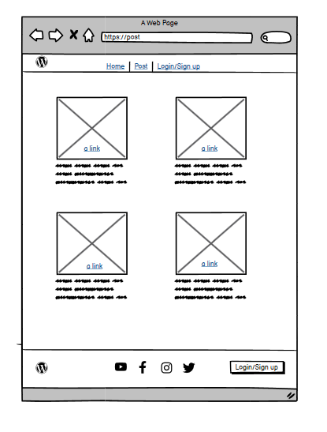
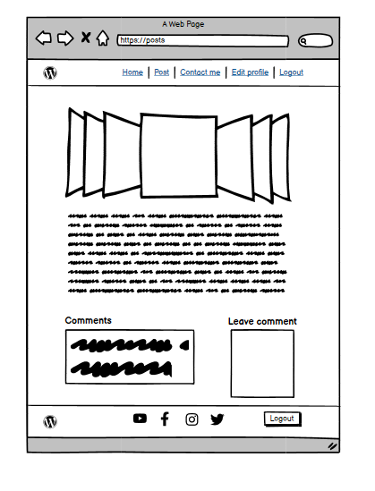
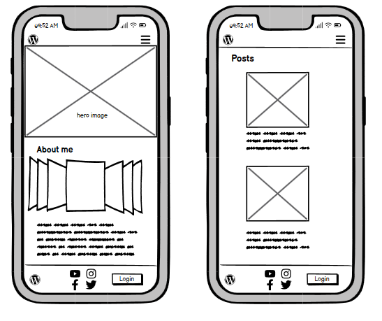
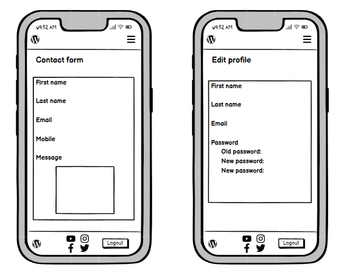

# Take a hike

Take a hike is fully responsive full stack webiste created to promote adventure style of life and to give users opportunity to explore local area/ mountains with us.

## Table of contents
- [User Experience](#user-experience)
	- [Project Goals](#project-goals)
	- [User Stories](#user-stories)
- [Database](#database)
- [Design](#design)
  - [Color](#color)
  - [Fonts](#fonts)
  - [Wireframes](#wireframes)
## User experience
### Project Goals
Is to provide a user with basic information about the certain hiking trails/areas in the local community through regular posts. Then to give a user option to express their sattisfaction/disfattisaction with the hikes they did in past by enabling them to leave comments on posts, and also for user to be able to book next hiking day with our community.
### User Stories
- As a first time user I want to understand the purpose of the website and easily navigate through
- As a first time user I want to be able to view list of post so I can select one to read
- As a first time user I want to be able to see likes and comments for each post in order to get some feedback from other users
- As a first time user I want to be able to register account to have more acces to the website
- As a registered user I want to be able to leave comments for posts
- As a registered user I want to be able to like/unlike posts
- As a registered user I want to be able to create booking for upcoming hike
- As a site owner I want to be able to create,read,update and delete posts so that I can manage my website content
- As a site owner I want to be able to approve or disapprove comments so that I can filter out objectionable comments
- As a site owner I want to be able to create,read,update and delete bookings
## Database
## Design
### Color
### Fonts
### Wireframes

Home page

Post page

Posts page

Contact & Edit profile page

Signup page

Mobile Home & Post page

Mobile Contact & Edit profile page

Mobile Posts page and Navigation menu

