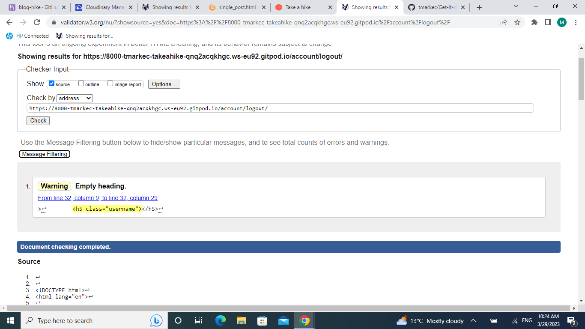

# Take a hike - Testing

:arrow_left: [Return to the README](README.md)

## Table of Contents
- [Performance](#performance)
  - [Google's Lighthouse Performance](#googles-lighthouse-performance)
- [Code Validation](#code-validation)
  - [HTML Validation](#html-validation)
  - [CSS Validation](#css-validation)
  - [PEP8 Validation](#pep8-python)
  - [Javascript Validation](#javascript-validation)
- [Testing](#testing)
  - [Manual Testing (BDD)](#manual-testing-bdd)
  - [Automated Testing](#automated-testing)
  - [Features Testing](#features-testing)

## Performance

### Google's Lighthouse Performance

[Google Lighthouse](https://developers.google.com/web/tools/lighthouse) was used to test the performance of the website. 
#### Desktop Results:

#### Mobile Results:

*Go back to the [top](#table-of-contents)*

## Code Validation

### HTML Validation
The [W3C Markup Validation Service](https://validator.w3.org/) was used to validate the HTML of the website.
Only profile page, I had to copy and paste code as I couldn't test as url page. Any error that is shown in validation test is cause of the Django templates. One particular that is shown accrosss website is **username** as username is displayed on navigation bar upon user login.
 

Home page

Post page

Single post page

Profile page

Signup page

Login page

Logout page

Search page

Password reset

Password reset done

Password reset complete

### CSS Validation 
[Jigsaw CSS validator](https://jigsaw.w3.org/css-validator/) was used for validating the CSS stylesheet. CSS file was tested by manually copying the CSS codes into the manual input option.

CSS Validation

### PEP8 Python
- [PEP8 CI Python Linter](https://pep8ci.herokuapp.com/) was used to check that the Python code meets PEP8 standards.

Admin

Forms

Views

Urls

Models

### JavaScript Validation

JS

JSHint Static Code Analysis Tool for JavaScript was used to validate the Javascript file. There was 1 warning for variable named 'new', and 1 undefined variable. As that code was coppied from other websites, I didn't change it as it would have effect on the code itself. No other errors or warnings are shown.

## Manual Testing (BDD)

BDD, or Behaviour Driven Development, is the process used to test user stories in a non-technical way, allowing anyone to test the features of an app.

User Story | BDD Test | Pass
--- | --- | :---:
As a first time visitor I want to understand the purpose of the website and easily navigate through | Upon landing on the index page, I can see big hero navigation bar with 'home' and 'post' links and bellow navigation there is big hero image displayed with hero text. Without scrolling further I can understand the purpose of this webiste| :white_check_mark:
As a first time visitor I want to be able to view the posts so that I would get quick access to relevant information and get better understanding of the content|I can easily navigate myself to the post page on which are shown different posts about different topics/hikes. If I wish to get more information about certain post I just have to click on the title which will redirect me to single_post page| :white_check_mark:
As a first time visitor I want to be able to see likes and comments for the posts in order to get some feedback from other users| I can either see numbers of likes and comments that are located under each post on the post page, if I wish to read comments all I have to do is click on the single post and comments will be displayed on the bottom of the page |:white_check_mark:
As a first time visitor I want to be able to register account to have more acces to the website | In the navigation bar there is button 'sign up' which will lead me to the signup page on which I have to fill all information in orther to register for the website | :white_check_mark:
As a first time visitor I want to be able to search posts by title name so I could get quicker access to the relevant one | On the post page there is a search bar in the top right corner, in which I can input a title/word that I'm looking for. If there is match word in the current posts that post will be displayed on the new page, and if not message will be displayed indicating that I should search another word | :white_check_mark:
As a first time visitor I want to be able to subscribe to the blog so I could get relevant information about future blog posts | On the bottom of the website in left corner in the footer there is input field with label that allows me to input my email address and subscribe to newsletter |:white_check_mark:
As a registered user I want to be able to leave comments for posts so that I can engage with other users and leave feedback about certain post | I can click on any post I want to comment, and that post will be displayed on the separate page. I have to scrool down after posts description and there is a box in which I can write my comment and submit it |:white_check_mark:
As a registered user I want to be able to like/unlike posts so that I can support certain posts without without providing comment | I can click on any post I want to like or unlike, and that post will be displayed on the separate page. I have to scrool down to the end of the description and like button will be displayed, if I already like the post that button will be coloured if not I can simply click on that button and like that post |:white_check_mark:

As a site user I want to be able to receive a feedback for my action  so that I know my inputs are working. | Given that I'm a site user When I register,login/logout, access CURD functionality for a post Then I should receive a confirmation message.| :white_check_mark:
As an author  I can access all my posts easily in one place  so that I can easily track my activity on the site. |Given that I'm a author of post When I am logged in and navigate to user-page Then I can view all of mine posted blog post.| :white_check_mark:
As an author/user I can fully access the CURD functionality   so that I can manage my blog content. | Given that I'm an author/user When I am logged in and navigate to user-page  Then I need to be able to CURD mine post content on the website.| :white_check_mark:
As a site admin I want to be able to review all posts, destinations, users, comments, etc  So that I can maintain the site and remove any offensive content. | Given that I'm a site admin When I navigate to the admin panel Then I should see all posts, destination, comments, likes, etc. | :white_check_mark:
As a site admin  I can approve or disapprove comments so that I can filter out objectionable comments.| Given that I'm a site admin When I navigate to the comment model in admin panel Then I need to be able to approve or disapprove any comments.| :white_check_mark:
As a site admin I want to be able to create/edit/update/delete a post  	so that I can maintain the site and remove any offensive content. | Given that I'm a site admin When I navigate to the admin panel Then I need to be able to control all the content on the website.| :white_check_mark:
As a site admin I want to be able to direct users to my social profiles  So that I can increase social interaction and attract new users. | Given that I'm a site admin When I view/scroll down to the footer Then I should see working links to my social media. | :white_check_mark:
As a site admin I want to be able to ensure that all areas of the site to function correctly and have no bugs  so that I can ensure an enjoyable browsing experience for all users. | Given that I'm a site admin When I check all site functionality Then I should see that everything works as expected, there are no bugs and all links and forms work as expected | :white_check_mark:

## Automated Testing

I have performed some basic automated tests on the forms, urls and models. The tests passed as shown below.

.

## Features Testing

In addition to the other tests, I have conducted a manual check list for different features of website to make sure that everything is working as intended.

| Status | **Navigation Bar - User Logged Out**
|:-------:|:--------|
| &check; | Clicking the navbar logo loads the home page
| &check; | Navbar shows the nav links for Home, About, Blog, Register, Login, Destination and search field, search button if the user is logged out
| &check; | Clicking the Home tab on the navbar loads the home page
| &check; | Clicking the About tab on the navbar loads the about page
| &check; | Clicking the Blog tab on the navbar loads the blog page
| &check; | Clicking the Login tab on the navbar loads the login Page
| &check; | Clicking the Register tab on the navbar loads the register page
| &check; | Clicking the Destination tab on the navbar loads the destination page
| &check; | Clicking the Search button on the navbar loads the search page

| Status | **Navigation Bar - User Logged In**
|:-------:|:--------|
| &check; | Clicking on navbar logo, Home, About, Blog, Destination, Search loads the relevant page as described above for user logged out
| &check; | Navbar shows the tabs Home, About, Blog, Logout, UserName(for example: Mahi), Destination and search field, search button if the user is logged in
| &check; | The navbar shows the username of the logged in user and clicking on that username tab loads the user page
| &check; | Clicking the Logout tab on the navbar loads the logout page

| Status | **Footer - User Logged Out/In**
|:-------:|:--------|
| &check; | Clicking the heading 'Incredible India' loads the home page
| &check; | Clicking the LinkedIn/icon loads the my LinkedIn in a new tab
| &check; | Clicking the Github/icon loads the my GitHub in a new tab

| Status | **Destination Dropdown**
|:-------:|:--------|
| &check; | Clicking on the Destination tab shows a dropdown list which further shows the selected destination post

| Status | **Home Page**
|:-------:|:--------|
| &check; | User can see the carousel images on first view
| &check; | The Destination section navigates to the blog post of the selected destination type

| Status | **Blog Page**
|:-------:|:--------|
| &check; | Shows the blog posts paginated by 9 posts and the prev/next button works as expected
| &check; | Clicking on the post image and title loads the post detail page.

| Status | **Post Detail Page**
|:-------:|:--------|
| &check; | Shows the full content of the post
| &check; | Shows a list of comments posted so far, if any
| &check; | Comment box is visible with Sign Up and Sign In link 

| Status | **Post Detail Page - User logged in**
|:-------:|:--------|
| &check; | Shows the full content of the post
| &check; | Like icon works only when the user is logged in
| &check; | Shows a list of comments posted so far, if any 
| &check; | Comment box is visible with comment body input field and submit button 
| &check; | Submitted comment displays in comment list
| &check; | Edit/delete buttons are visible only for user's own comment

| Status | **Edit comment - User logged in**
|:-------:|:--------|
| &check; | That the user can see the comment body input field is already prepoulated with the content as it currently is
| &check; | Clicking Update button, updates the comment content
| &check; | That an alert message informs the user that their comment has been updated successfully

| Status | **Delete Comment - User Logged In**
|:-------:|:--------|
| &check; | That the user can see a modal to make sure to delete the comment
| &check; | Clicking the Close button fade the modal
| &check; | Clicking the Delete button inform the user that the comment deleted successfully

| Status | **Add a Post - User Logged In**
|:-------:|:--------|
| &check; | That the Title input field is required
| &check; | That the Content field is required
| &check; | That the Best Time field is required
| &check; | That the Ideal Duration field is required
| &check; | That the form cannot be submitted without all the required fields and user feedback is given if a user forgets a required field
| &cross; | That when the form is submitted a post slug is automatically created from the title 

Empty slug screenshot

 
| &check; | That when the form is submitted a post author field is automatically created
| &check; | That when the post is added, the user is redirected back to the 'User page' and a message alert informs the user that the post added successfully

| Status | **Edit Post - User Logged In**
|:-------:|:--------|
| &check; | That the user can see the post input field is already prepoulated with the content as it currently is
| &check; | Clicking Update button, updates the post content
| &check; | That an alert message informs the user that their post has been updated successfully

| Status | **Delete Post - User Logged In**
|:-------:|:--------|
| &check; | That the user can see the user name and the message with post title that they would like to delete their post
| &check; | Clicking the Delete button redirects back to the User post list page
| &check; | That an alert message informs the user that they successfully deleted their post
| &check; | That the post is completely deleted and doesnt show up in the database or subsequently any place on the website
