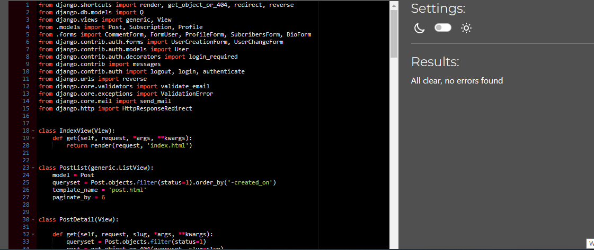

# Take a hike - Testing

:arrow_left: [Return to the README](README.md)

## Table of Contents
- [Performance](#performance)
  - [Google's Lighthouse Performance](#googles-lighthouse-performance)
- [Browser Compatibility](#browser-compatibility)
  - [Google's Lighthouse Performance](#googles-lighthouse-performance)
- [Code Validation](#code-validation)
  - [HTML Validation](#html-validation)
  - [CSS Validation](#css-validation)
  - [PEP8 Validation](#pep8-python)
  - [Javascript Validation](#javascript-validation)
- [Testing](#testing)
  - [Manual Testing (BDD)](#manual-testing-bdd)
  - [Automated Testing](#automated-testing)
  - [Features Testing](#features-testing)

## Performance

### Google's Lighthouse Performance

[Google Lighthouse](https://developers.google.com/web/tools/lighthouse) was used to test the performance of the website.

#### Desktop Results:

Desktop

#### Mobile Results:

Mobile

## Browser Compatibility

## Code Validation

### HTML Validation
The [W3C Markup Validation Service](https://validator.w3.org/) was used to validate the HTML of the website.
Only profile page, I had to copy and paste code as I couldn't test as url page. Any error that is shown in validation test is cause of the Django templates. One particular that is shown accrosss website is **username** as username is displayed on navigation bar upon user login.
 

Home page

Post page

Single post page

Profile page

Signup page

Login page

Logout page

Search page

Password reset

Password reset done

Password reset complete

### CSS Validation 
[Jigsaw CSS validator](https://jigsaw.w3.org/css-validator/) was used for validating the CSS stylesheet. CSS file was tested by manually copying the CSS codes into the manual input option.

CSS Validation

### PEP8 Python
[PEP8 CI Python Linter](https://pep8ci.herokuapp.com/) was used to check that the Python code meets PEP8 standards.

Admin

Forms

Views

Urls

Models

### JavaScript Validation

JS

JSHint Static Code Analysis Tool for JavaScript was used to validate the Javascript file. There was 1 warning for variable named 'new', and 1 undefined variable. As that code was coppied from other websites, I didn't change it as it would have effect on the code itself. No other errors or warnings are shown.

## Manual Testing (BDD)

BDD, or Behaviour Driven Development, is the process used to test user stories in a non-technical way, allowing anyone to test the features of an app.

User Story | BDD Test | Pass
--- | --- | :---:
As a first time visitor I want to understand the purpose of the website and easily navigate through | Upon landing on the index page, I can see big hero navigation bar with 'home' and 'post' links and bellow navigation there is big hero image displayed with hero text. Without scrolling further I can understand the purpose of this webiste| :white_check_mark:
As a first time visitor I want to be able to view the posts so that I would get quick access to relevant information and get better understanding of the content|I can easily navigate myself to the post page on which are shown different posts about different topics/hikes. If I wish to get more information about certain post I just have to click on the title which will redirect me to single_post page| :white_check_mark:
As a first time visitor I want to be able to see likes and comments for the posts in order to get some feedback from other users| I can either see numbers of likes and comments that are located under each post on the post page, if I wish to read comments all I have to do is click on the single post and comments will be displayed on the bottom of the page |:white_check_mark:
As a first time visitor I want to be able to register account to have more acces to the website | In the navigation bar there is button 'sign up' which will lead me to the signup page on which I have to fill all information in orther to register for the website | :white_check_mark:
As a first time visitor I want to be able to search posts by title name so I could get quicker access to the relevant one | On the post page there is a search bar in the top right corner, in which I can input a title/word that I'm looking for. If there is match word in the current posts that post will be displayed on the new page, and if not message will be displayed indicating that I should search another word | :white_check_mark:
As a first time visitor I want to be able to subscribe to the blog so I could get relevant information about future blog posts | On the bottom of the website in left corner in the footer there is input field with label that allows me to input my email address and subscribe to newsletter |:white_check_mark:
As a registered user I want to be able to leave comments for posts so that I can engage with other users and leave feedback about certain post | I can click on any post I want to comment, and that post will be displayed on the separate page. I have to scrool down after posts description and there is a box in which I can write my comment and submit it |:white_check_mark:
As a registered user I want to be able to like/unlike posts so that I can support certain posts without without providing comment | I can click on any post I want to like or unlike, and that post will be displayed on the separate page. I have to scrool down to the end of the description and like button will be displayed, if I already like the post that button will be coloured if not I can simply click on that button and like that post |:white_check_mark:
As a registered user I want to be able to update my profile information so that I could change my first name, last name, email and password and to add profile picture, bio | After logging in to the website I can click on the prfile page in the navbar which will lead me to profile page. Page is divided in two sectionss, one is displaying current information and other gives me option to implement CRUD functionality | :white_check_mark:
As a site owner I want to be able to create, update and delete posts so that I can control my website content. |After logging in to the admin panel of the website I can navigate myselft to Post model and perform CRUD functionality for the posts| :white_check_mark:
As a site owner I want to be able to approve or delete comments so that I can filter out objectionable comments | After logging in to the admin panel of the website I can navigate myselft to Comments model and from there I can pick comment which I want to approve or delete| :white_check_mark:
As a site owner I want to be able to access all subscribed emails so that I could send new information related to my website | After logging in to the admin panel of the website I can navigate myselft to Subscribed model in which are displayed all subscribed emails | :white_check_mark:
As a site owner I want to be able to delete user so that I can receive several benefits such as: manage my data, reduce liability & resource optimization| After logging in to the admin panel of the website I can navigate myselft to Users which is Django all auth model in which are displayed all registered users, from that model I can either update or delete specific users| :white_check_mark:

## Automated Testing

I have performed some basic automated tests on the forms, urls and models. The tests passed as shown below.

## Features Testing

In addition to the other tests, I have conducted a manual check list for different features of website to make sure that everything is working as intended.

| Status | **Navigation Bar - User Logged Out**
|:-------:|:--------|
| &check; | Clicking the navbar logo loads the home page
| &check; | Navbar shows the nav links for Home, Post and buttons for Sign up and Sign In
| &check; | Clicking the Home tab on the navbar loads the home page
| &check; | Clicking the Post tab on the navbar loads the post page
| &check; | Clicking the Sign in button on the navbar loads the Sign in page
| &check; | Clicking the Sign up button on the navbar loads the Sign up page

| Status | **Navigation Bar - User Logged In**
|:-------:|:--------|
| &check; | User name is displayed next to the logo
| &check; | Navbar shows additional link for Profile

| Status | **Footer - User Logged Out/In**
|:-------:|:--------|
| &check; | Clicking the footer logo loads the home page
| &check; | Clicking the LinkedIn,Facebook,Youtube, Instagram/icons dirrect user to relevant pages
| &check; | Subscribe input field is displayed

| Status | **Subscribe field**
|:-------:|:--------|
| &check; | No input not allowed
| &check; | Standard email characters allowed
| &check; | After submitting confirmation message is displayed to the user

| Status | **Home Page**
|:-------:|:--------|
| &check; | User can get more insight about the author/owner through brief text, picture and 

| Status | **Blog Page**
|:-------:|:--------|
| &check; | Shows the blog posts paginated by 6 posts and the prev/next button works as expected
| &check; | Clicking on the post title user is redirected to single post page

| Status | **Single post Page**
|:-------:|:--------|
| &check; | Shows the full content of the post
| &check; | Shows a list of comments posted so far with numbers of likes, if any
| &check; | Comment box is only visible to registered users
| &check; | Only register user can like post

| Status | **Profile page**
|:-------:|:--------|
| &check; | User information is displayed to the user
| &check; | Input fields are provided for user to change his details
| &check; | Extra field for Bio and Image are provided
| &check; | Two buttons bellow the for work as expected

| Status | **Profile page Update**
|:-------:|:--------|
| &check; | Changing any fields, or adding picture upon click on 'Update' button new information is displayed to the user
| &check; | Confirmation message is shown to the user

| Status | **Profile delete**
|:-------:|:--------|
| &check; | Clicking 'Delete' button, modal is dispalyed to the user to confirm his actions
| &check; | Clicking 'Cancel' in the modal user is redirected to the Profile page
| &check; | Clicking 'Delete' in the modal us is redirected to the Home page, and confirmation message is displayed to the user

| Status | **Search field**
|:-------:|:--------|
| &check; | No input is not allowed
| &check; | Search not matched to the post - user is prompt with the message to try again on the new page
| &check; | Search matches the post - post is dislayed to the user on the new page

| Status | **Login page**
|:-------:|:--------|
| &check; | No input not allowed
| &check; | Messages displayed to the user in case of wrong input

| Status | **Forget password/reset password link**
|:-------:|:--------|
| &check; | Clicking on either links user is navigated to password change page

| Status | **Password change route**
|:-------:|:--------|
| &check; | Input field is displayed on the password cahnge page for user to provide email in order to recover password
| &check; | After submitting new page displayed with further instructions for user what to do next
| &check; | If email matches registered username clickable link is provided in inbox
| &check; | If email doesn't match registered username message is displayed to ignore that email, if not registered with Take a hike website
| &check; | Link redirects to input new password page
| &check; | Password must pass all standard criteria
| &check; | After submitting new password user new page with conformation is displayed to the user with link to sign in to the website

| Status | **Logout**
|:-------:|:--------|
| &check; | Clicking on logout user is redirected to new page, asking user to confirm his choice
| &check; | Clicking 'Sign out' user is redirected to the home page with confirmation message displayed to the user

| Status | **Sign up**
|:-------:|:--------|
| &check; | Clicking on Sign up in the navigation bar new page is displayed to user with input fields
| &check; | All input fields must be put in in order for user to sign in, standard criteria for email and passowrdfs are present
| &check; | Relevant messages are displayed to the user if certain field doesn't match the criteria
| &check; | Upon singing up, user is dirrectly logged into the website and prompt message is displayed to the user indicating that he has  succesfully signed up

| Status | **Back link**
|:-------:|:--------|
| &check; | Link is displayed on 2 pages 'Search post' & 'Single post'
| &check; | Clicking 'Back' link user is redirected to previous page

*Go back to the [top](#table-of-contents)*