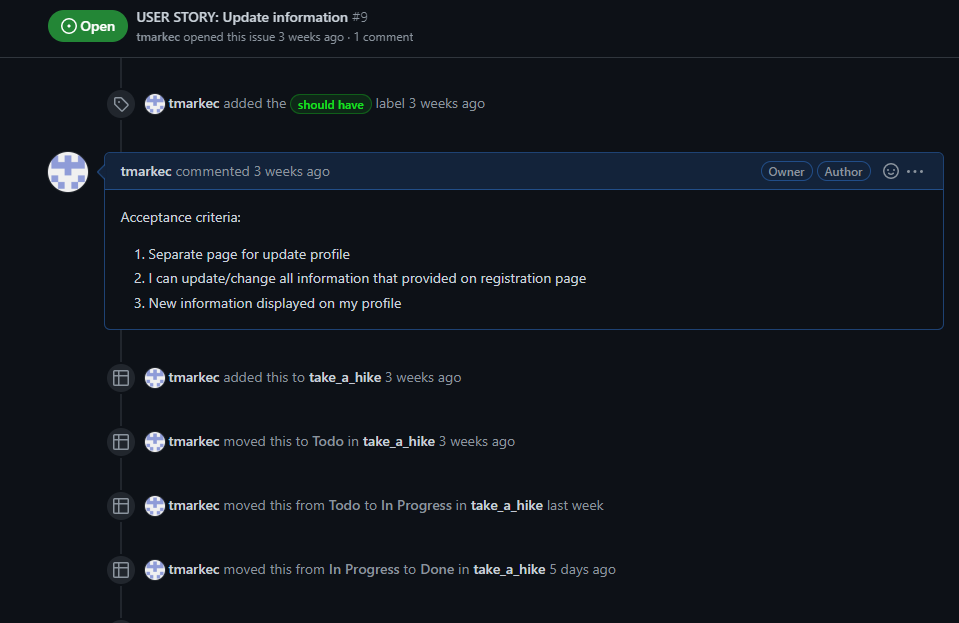

# The Recipe Blog

Take a hike is fully responsive full stack webiste that I built using the Dajngo Full Stack framework for my Portfolio Project 4. I created this website to promote adventure style of life and to give users opportunity to explore local area/ mountains with us.
  
  

[Click Here To Visit Live Site](https://blog-hike.herokuapp.com/)  

## Table Of Contents:
1. [UX Design](#ux-design)
    * [User Stories](#user-stories)
    * [Wireframes](#wireframes)
    * [Agile Methodology](#agile-methodology)
    * [Typography](#typography)
    * [Colour Scheme](#colour-scheme)
    * [Database Diagram](#database-diagram)
    
2. [Features](#features)
    * [Navigation](#Navigation-bar)
    * [footer](#footer)

3. [Future Features](#future-features)
4. [Technologies Used](#technologies-used)
5. [Testing](#testing)
6. [Deployment](#deployment)
7. [Credits](#credits)
8. [Acknowledgements](#acknowledgements)

## UX Design:

### User Stories
- As a first time user I want to understand the purpose of the website and easily navigate through
- As a first time user I want to be able to view list of post so that I would get quick access to relevant information and get better understanding of content
- As a first time user I want to be able to see likes and comments for each post in order to get some feedback from other users
- As a first time user I want to be able to register account to have more acces to the website
- As a registered user I want to be able to leave comments for posts so that I can engage with other users and leave feedback about certain topic
- As a registered user I want to be able to like/unlike posts so that I can support certain posts without leaving a comment
- As a registered user I want to be able to contact owner of the site so that I could get more information and be included in future events
- As a registered user I want to be able to update my profile information so that I could make changes for new password, email etc
- As a site owner I want to be able to create, update and delete posts so that I can control my website content
- As a site owner I want to be able to approve or delete comments so that I can filter out objectionable comments
- As a site owner I want to be able to delete user so that I can receive several benefits such as: manage my data, reduce liability , resource optimization etc...

### Wireframes
Below are the wireframes for the site that I created using balsamiq. 

Home page

Post page

Posts page

Contact & Edit profile page

Signup page

Mobile Home & Post page

Mobile Contact & Edit profile page

Mobile Posts page and Navigation menu

  
### Agile Methodology
The Agile Methodology was used to plan this project. This was implemented through Github and the Project Board. Through the use of the Kanban board in the projects view in Github, the project was divided into a few different sections: 

* To Do- (All the User stories were initially entered in the 'To Do' column)
* In Progress- (then during development story they were moved into the 'In Progress' column)
* Done- (and then finally they get moved into 'Done' once the development completes)

Project board

Milestones

Milestone detail

Issues board

User story detail

### Typography
- The font that was used for the logo was **Allerta Stencil**.
- The font that was used for the heading on the home page was **Satisfy**.
- **Athiti** font was used for the body.

### Colour Scheme
For this site I decide to keep the main color scheme very simple, with the text either being white or black and the navbar background and icons being green.
I did also have some buttons like the delete and cancel buttons red and orange, but the main color scheme of the site was black, white and green.
  
  
- - - 

### DataBase Diagram
Below is the database diagram that I created using LucidCharts.

  
- - - 

## Features:

### Navigation Bar
- The Navigation bar sits at the very top of each page, The logo is at the right hand side and the navigation links are on the left.
- When logged in some of the links change, like the **Login** becomes **Logout** and the **Registeration** link is removed and **Wine** link added.
- The Navbar background is green with the Navigation links and logo in white colored text.
- On large to xx-large screens the navigation bar is in the center of the page and is sized by the bootstrap [container-lg](https://getbootstrap.com/docs/5.0/layout/containers/) class.
- The active page (page that the user is currently on) is displayed in bold text, this makes it stand out much more and is clear to the user which page they are on.
- When on medium to small screens the navigation menu changes to burger menu which shows all the nav links when clicked on (second screenshot below).
  
  

**Nav bar on mobile and tablets**  

 

### Footer
- The footer is found at the bottom of every page and responsive for tablet and mobile too.
- It displays 4 icons for the biggest social media platforms today, Twitter, Facebook, Youtube and Instagram. These are all green in colour to match the sites colour scheme
- Above the icons there is a horizontal line that is centered, and it is 30% of the screen width on large devices, 50% on medium and 60% on small devices.
- When any of the icons are clicked the social media site opens on a seperate tab, this way the user still has the The Recipe Blog website open so they can easily navigate back to it.
  
 
- - -  

### Home Page
- The home page has a background image of food on a table and has a light black linear gradiant to darken the image a bit and bring up the text color.
- In the center there is a H1 heading that says **The Recipe Blog** in green.
- Below the heading there is a text box that explains what the site is about, the text box has a white border around it and the backgound is a bit darker, the text is then in white which really makes it stand out.

 
- - -  

### Recipes Page
- At the top of the recipes page, right below the Nav bar there is a H1 heading that says **Recipes List** which is underlined and centered.
- Below this are the recipe cards which are displayed in the bootstrap card format and have six to a page.
- The **Read more** button is greyed out when the user is logged out and is green when the user is logged in (second screeshot).
- Above the recipes on the left hand side there is a green **Add Recipe** button, this button is only displayed if the user is logged in.
- On Large screens they are three across, on medium devices they are two across and on small devices it is just one.
- Below the recipe cards there will be a next and back button depending on how many recipes have been added.  

**Recipes page when user is logged in** 

  
[Back to the top](#the-recipe-blog)
- - -    
  
### Recipe Details
- At the top of the of the recipe details page in the center is the photo of the recipe.
- If the user who posted the recipe is viewing it, then the delete and edit buttons are visible at the top right.
- Below the image and center is the title of the recipe and the author who has posted it.
- Below the image to the left you have a like button that shows how many people liked the recipe, the heart will be an empty outline with a 0 next to it if no one has liked it, and it will be filled red if liked.
- Underneath the like button you have **Description**, **Ingredients** and **Cooking Instructions** fields.
- Then there is the comment section below this, which has a H2 heading that says **Comment Section**, The comment section has a border around it, and comments have a light grey backgound colour, which makes them stand out. The authors name and date is displayed below the comment and there is an edit and delete button in the top right of the comment which is only visible to the author of the comment.
- Below this is the **Post a Comment** section which has a border around it. Inside is the **info** text area where the user can enter their comment and then below that is the green **Post** button.

- - -   

### Add Recipe Page
- When a user clicks the **Add Recipe** button on the **Recipes** page they are taken to the **Add Recipe page** where they are greeted with a form to enter their recipe.
- At the top there is a H1 heading that says **Add Your Recipe below** with the form fields beneath it. I kept the form big and simple, so that it is easy for the user to use and everything is centered.
- For the **Description**, **Ingredients** and **Cooking Instructions** fields the summernote widget is used so that a user can easily format their text, and style it whatever way they wish.
- Below this is a **Submit** button that is in green and once clicked the recipe will be submitted and the user returned to the recipe page where they will see their recipe as the first in the list.
- Beside the **Submit** button there is a orange **Cancel** button that once clicked will bring the user back to the recipe page.
  

- - -

### Edit Recipe Page
- The **Edit Recipe** page is accessed when the user clicks the edit recipe pencil icon on the recipe details page.
- This is practically the same as the **Add Recipe** page. The only difference is that the form is already filled in with the details you entered before so that you can change them, and also the heading says **Edit Your Recipe**
- After editing the Recipe a success message will be displayed at the top of the screen.
- Please note that only the user who created the recipe can edit it from here.

[Back to the top](#the-recipe-blog)
- - -

### Delete Recipe
- When a user clicks on the delete icon on the recipe details page a bootstrap modal pops up in the center and asks the user to confirm.
- The modal is a square box with a grey background, with a heading that says **Delete Recipe** and the center text asks **Are you sure you want to delete the recipe**.
- At the bottom right of the modal box is a red **Yes** button to confim if they want to delete it. The button is red because red is associated with danger and if clicked the recipe will be gone. Once clicked the recipe will be deleted and the user will be returned to the recipes page.
- Beside the **Yes** button there is a **Cancel** button, that when clicked will make the modal disappear, there is also an **X** in the top right of the modal that will also get rid of it.
- If the user clicks anywhere else on the screen the modal will also disappear.
- Please note that only the user who created the recipe can delete it from here.
- After deleting the Recipe a success message will be displayed at the top of the screen.

- - -

### Edit comment Page
- When the edit comment icon is clicked at the right of the comment, the user is brought to the edit comment page.
- This is just a bigger version of the **Post a Comment** section on the recipe details page, but it has the comment message you posted in the **info** box for you to edit.
- Above this there is a heading that tells you to **Edit the comment you posted on the certain date and time**
- There is an green **update** button below the text box that when clicked will update the comment and bring you back to the recipe details page where you can view your updated comment.
- Beside this is an amber **Cancel** button that returns the user to recipe details page, if they decide not to update the comment.
- Please note that only the user who created the comment can edit it from here.
- After editing the Comment a success message will be displayed at the top of the screen.

- - -

### Wines Page
- The **Wines** page is only visible when the user is logged in, the nav link is not there when a user is logged out.
- This page layout is exactly like the **Recipes** page, with a H1 heading at the top that says **Wine List**.
- Below the heading on the left hand side is a button to **Add a Wine**.
- Below this are the wine cards which are displayed in the bootstrap card format and have six to a page.
- In the Wine card there is green **view** button that takes the user to the **Wine Detail** page.
- Below the Wine cards there will be a next and back button depending on how many wines have been added.

- - -

### Wine Details page
- When a user clicks the green **View** button on one of the Wine cards from the **Wines** page they are brought to the **Wine Details** page.
- Here the user will see a larger bootstrap card that is centered, this displays the image larger and all of the wine details. There is a border around the card which is standard with bootstrap cards.
- If the user who added the wine is looking at it there will be a **Edit** and **Delete** Button at the bottom.

- - -

### Add Wine Page
- When a user clicks the **Add Wine** button on the **Wines** page they are taken to the **Add Wine** page where they are greeted with a form to enter the details of the wine.
- At the top is a H1 heading that says for the user to **Add a Wine Below**
- Below the heading is a simple form that is centered on the page and asks the user to fill in the following fields enter the **Name** of the wine, upload an **Image**, choose a type of **Wine** from the drop down, add the **Alcohol Percentage** and finally add the **Country of Orgin** for the wine.
- Below this is a green **Submit** button that when clicked adds the wine and brings the user back to the Wines page, where they can see the wine they added as the first in the list.
- Beside the **Submit** button is an amber **Cancel** button, that will bring the user back to the **Wines** page if they decide that they do not want to post a wine.
- After adding a Wine a success message will be displayed at the top of the screen.

- - -

### Edit Wine Page
- The **Edit Wine page** is accessed when the user clicks the **Edit** button on the **Wine details** page.
- This exactly the same as the **Add Wine** page only for it has the details that the user already entered filled into the form fields so that the user can edit them and the heading also says **Edit Wine**
- Please note that only the user who created the wine can edit it from here.
- After editing the Wine a success message will be displayed at the top of the screen.

- - -

### Delete Wine
- When a user clicks on the **Delete** button on the **Wine Details** page a bootstrap modal pops up in the center and ask the user to confirm.
- This Modal is practically the same as the Delete recipe modal.
- After deleting the Wine a success message will be displayed at the top of the screen.

[Back to the top](#the-recipe-blog)
- - -

### Register Page
- The **Register** page has grey banner running accross the page and it has an image at the right hand side of the banner. In the center of the Banner is a green heading saying **Sign Up** and
beneath that it tells the user if they already have an account they can click here to go to the login page.
- Beneath this is a centered form so that the user can enter a **Username**, a **Email** which is optional and then enter the **password** which they will have to confirm by entering it again.
- At the bottom of the form there is a green **Sign Up** button.
- When the user fills out the form and clicks the **Sign Up** button then they will be logged in and redirected to the home page.
- The register nav link is not visible when a user is already signed in.

- - -

### Login Page
- The **login** page is similar to the register page as it has a grey banner running accross the page and it has an image at the left hand side of the banner. In the center of the banner is a green heading saying **Sign In** and underneath  it tells the user if they dont have an account they can click here to go to the register page.
- Below the banner and centered is the login form with the **Username** and **Password**  fields and a **Remember Me** checkbox. At the bottom of the form is a green **SIGN IN** button and once clicked, it signs the user in and redirects them to the home page.
- The login Nav link changes to a logout link when the user is signed in.

- - -

### Logout page
- The **logout** page follows the same style as the regiser and login pages with a grey banner accross the screen, It has a green heading that says **Sign out** and asks the user if they are sure they want to sign out. Below this is a green **Sign Out** button which when clicked signs the user out and redirects them to the **Sign In** page.

- - -

## Future Features
- In the future I would like to make it mandatory for a user to enter their email when registering and then send them a varification email to their email and they would have to verify their account before they could register. I think this would make the site alot more secure as people could not just sign up with any username, this way it would be tied to a email account.
- Also in the future I would like the user to have a profile section, so they could upload a photo and then also customize their profile. I think it would also look better if the recipe and comments had a small photo of the user who posted next to it, like you see on social media platforms.

## Technologies Used
- [Balsamiq](https://en.wikipedia.org/wiki/Balsamiq) was used to create the wireframes.
- [LucidChart](https://www.lucidchart.com/pages/) was used to design the database schema.
- [HTML](https://en.wikipedia.org/wiki/HTML) was used for the mark up.
- [CSS](https://en.wikipedia.org/wiki/CSS)  was used to style the site.
- [Django](https://www.djangoproject.com/) was the framework that was used.
- [Python](https://en.wikipedia.org/wiki/Python_(programming_language)), django is a python framework.
- [Bootstrap](https://en.wikipedia.org/wiki/Bootstrap_(front-end_framework)) was also used to style the site.
- [JavaScript](https://en.wikipedia.org/wiki/JavaScript) was used for interactiveness.
- [Gitpod](https://www.gitpod.io/about) was used to create this site and then push everything to github.
- [Heroku](https://en.wikipedia.org/wiki/Heroku) is used to host this site.
- [Github](https://en.wikipedia.org/wiki/GitHub) was used to store the code.
- [Git](https://en.wikipedia.org/wiki/Git) was used for version control.
- [Cloudinary](https://cloudinary.com/) was used to store the images.
- [ElephantSQL](https://www.elephantsql.com/) was used to store the database.
- - -

## Testing
The testing section can be found [here](TESTING.md).

## Deployment
This website is deployed to Heroku from a github repository, the following steps were taken:

#### Creating Respository on Github
- First make sure you are signed into [Github](https://github.com/) and go to code institutes template, which can be found [here](https://github.com/Code-Institute-Org/gitpod-full-template).
- Then click on **use this template** and select **Create a new repository** from the drop down. Enter the name for the repository and click **Create repository from template**.
- Once the repository was created, I clicked the green **gitpod** button to create a workspace in gitpod so that I could write the code for the site.

#### Creating app on Heroku
- After creating the repository on github, head over to [heroku](https://www.heroku.com/) and sign in.
- On the home page, click **New** and **Create new app** from the drop down.
- Give the app a name(this must be unique) and select a **region** I chose **Europe** as I am in Europe, Then click **Create app**.

#### Create a database On ElephantSQL
- Log into the [ElephantSQL](https://www.elephantsql.com/) website and click **Create new Instance**
- Enter a **Name** and keep the plan as **Tiny Turtle Free**, then **tags** field can be left blank, Select a region closest to you, I selected **EU-West-1(Ireland)** as I'm in Ireland. Then click **Review** and afterwards click **create instance**.
- On The Dashboard click on your database instance name.
- You will see the details for your database instance, in the url section click on the copy icon to copy the database url.
- Head over to gitpod and create a **Database URL** enviroment variable in your env.py file and set it equal to the copied url.

#### Deploying to Heroku.
- Head back over to [heroku](https://www.heroku.com/) and click on your **app** and then go to the **Settings tab**
- On the **settings page** scroll down to the **config vars** section and enter the **DATABASE_URL** which you will set equal to the elephantSQL url, create **Secret key** this can be anything,
**CLOUDINARY_URL** this will be set to your cloudinary url and finally **Port** which will be set to 8000.
- Then scroll to the top and go to the **deploy tab** and go down to the **Deployment method** section and select **Github** and then sign into your account.
- Below that in the **search for a repository to connect to** search box enter the name of your repository that you created on **github** and click **connect**
- Once it has connected scroll down to the **Manual Deploy** and click **Deploy branch** when it has deployed you will see a **view app** button below and this will bring you to your newly deployed app.
- Please note that when deploying manually you will have to deploy after each change you make to your repository.
- - -

## Credits
- Django For Beginners book, I wish I had read this book before I started the project as it would have made everything so much easier, I had most of the project done before I started to read this book but after reading the first 8 chapters I decided to go back and add the **Wines** app to the project to test out what I had learned, this made me understand how to create simple class based views. The first 4 chapters can be read [here](https://djangoforbeginners.com/introduction/).
- Code Institutes **I Think I Can Blog** walk through was a great help, this really thought me the fundamentals of creating a project with django, I would have been totally lost without this.
- Emmanuel Okiches youtube video for how to add an **active** class using djangos template lanuage. The video can be found [here](https://www.youtube.com/watch?v=e_D_hoJ1kAc).
- Denis Ivy's Django Framework(3.0) crash course on youtube was a great help for me in creating this project, this is a briliant resourse if you are learning Django. The vidoes can be found [here](https://www.youtube.com/watch?v=xv_bwpA_aEA&list=PL-51WBLyFTg2vW-_6XBoUpE7vpmoR3ztO).
- The Net Ninja's Django Tutorial on youtube is another great resource that helped me understand the framework, The youtube video series starts [here](https://www.youtube.com/watch?v=n-FTlQ7Djqc&list=PL4cUxeGkcC9ib4HsrXEYpQnTOTZE1x0uc&index=1).
- [Stack Overflow](https://stackoverflow.com/) is probably a developers best resource, this provided me with many answers to my questions.
- [W3schools](https://www.w3schools.com/) this was great for looking up forgotten **CSS** syntax and how to use it.
- [bbcgoodfood](https://www.bbcgoodfood.com/) as some of the recipes came from this site. This site is a great resource for anyone who likes cooking.
- [Unsplash](https://unsplash.com/) all images were take from unsplash.
- [30secondsofcode](https://www.30secondsofcode.org/articles/s/css-footer-at-the-bottom) showed me how to keep the footer at the bottom of the page.

## Acknowledgements:
- I would like to thank my mentor Adegbenga Adeye for all help throughout the project and for being really positive about the course.
- I would like to thank Code Institutes Slack Communtiy as this helped me so much when I got stuck on part of my project and also with course challenges.
- I would also like to thank our chort facilitators Kenan Wright and Kasia Bogucka, for answering any course related questions I asked and for porviding us with a weekly study schedule.

[Back to the top](#the-recipe-blog)